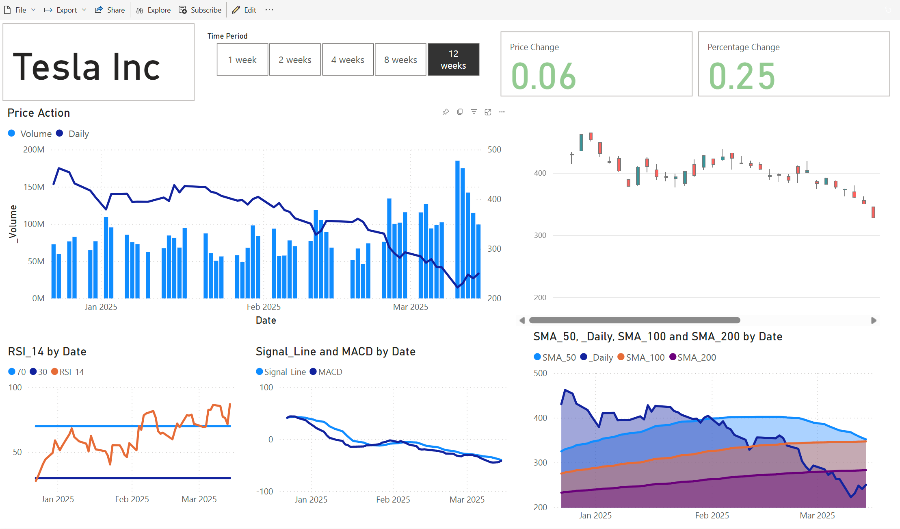

# PowerBI_Stockscreener
## **Stock Screening Dashboard – A Free Alternative for Swing Traders**

### **Overview**

The idea for this project came to me when I was analyzing stocks on **TradingView** and hit a frustrating paywall—I couldn't add more than three Simple Moving Averages (SMAs) without upgrading to premium. Being the cheapskate I am, I decided to build my own **custom stock screening tool** to visualize multiple technical indicators **for free**.

This **Power BI dashboard** serves as a **complementary tool** to **TradingView Supercharts**, enabling better-informed trading decisions by providing a **clear, data-driven view of key technical indicators** at a glance.

### **Why This Project?**

- 🚀 **Swing Trading Focus** – I prefer **bullish breakout patterns**, and this dashboard helps me quickly screen for potential setups without premium restrictions.
- 📊 **Live Stock Data Integration** – I wanted to work with a **live dataset**, so I leveraged **Alpha Vantage API** for daily stock data. While intraday data requires a premium subscription, it doesn’t matter for my use case, which focuses on **swing trading**.
- 💰 **A Practical, Cost-Effective Tool** – This project is designed for traders who want **more flexibility without paying for premium trading tools**.

### **Features**

✅ **Interactive Time Period Selection** – Analyze stock trends over **1 week to 12 weeks**  
✅ **Key Technical Indicators:**
- 📈 **Simple Moving Averages (SMA 50, 100, 200)**
- 📊 **Relative Strength Index (RSI 14)**
- 🔄 **MACD & Signal Line Crossovers**  

✅ **Candlestick & Price Action Charts** – Get a clear market view  
✅ **Live Data Integration** (via Alpha Vantage API)  
✅ **Performance Metrics** – Instant price and percentage change insights  

## **Tech Stack**
- 🖥 **Power BI** – Data visualization and dashboard development  
- 🌐 **Alpha Vantage API** – Fetching live stock data  
- 🔢 **DAX & M Query** – Data transformation and calculations  

 
